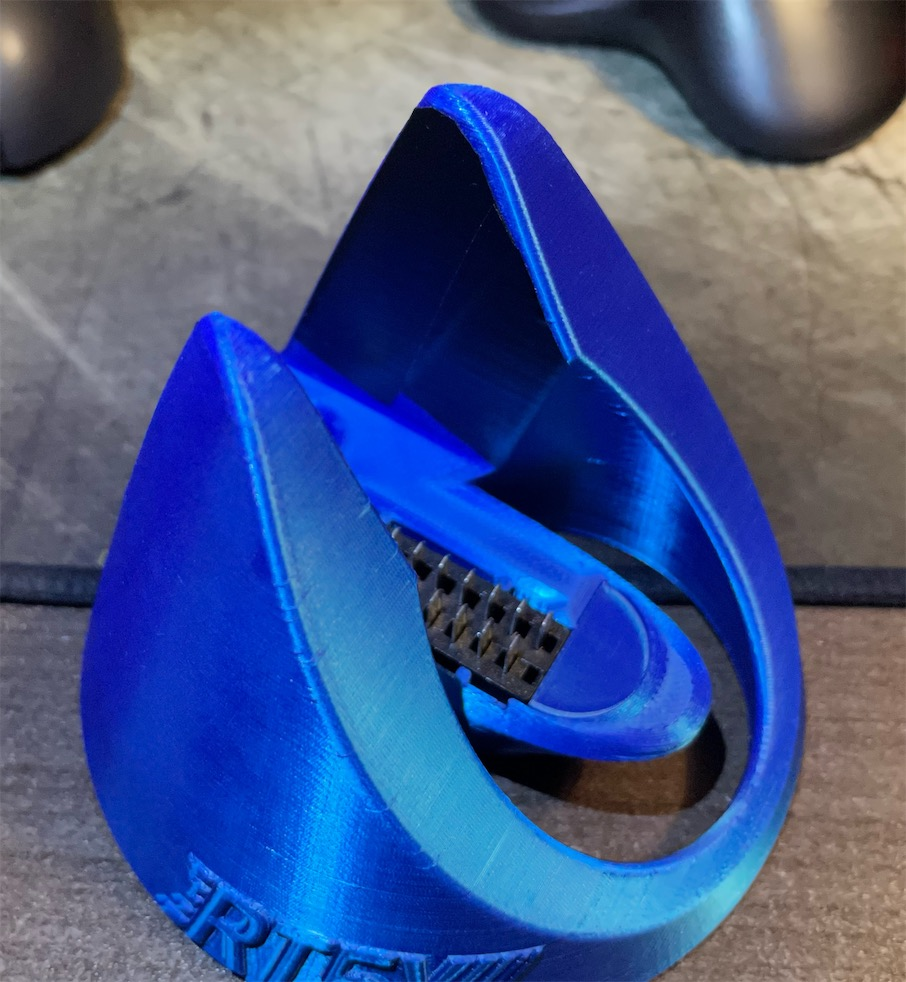

# Building The RetroTINK 5X Pro VGA Dock

 

&nbsp;

-------

## Parts

- [4x] BNC Headers, 75 Ohm, panel mount, solder cup (50 Ohm also works but not preferable) - [Link](https://github.com/jeffqchen/JeffParts/blob/main/Connectors/BNC%20Header/Panel%20Mount/Female/info.md)

- 3.5mm Audio Jack, panel mount - [Link](https://github.com/jeffqchen/JeffParts/blob/main/Connectors/3.5mm%20Audio%20Jack/Panel%20Mount/info.md)

- SCART Male Plug, Cable Type - [Link](https://github.com/jeffqchen/JeffParts/blob/main/Connectors/SCART/Male%20Cable/info.md)

- Resistor 470 Ohm 1/4W
  - Buy from wherever you feel like (DigiKey, Mouser, Amazon, Aliexpress, eBay)
---------

## 3D Printing

Print the models in their original orientations. Support is necessary for the main body. 0.16mm or lower layer height is suggested for better aesthetic.

The bottom piece is for protecting the innards of the dock. It's optional.

If you are afraid of the sides of the 5X being scratched agains the dock, apply some electric tape on the inside helps.

---------

## Preparing The SCART Plug

For the SCART plug, I suggest soldering color-coded wires before putting it into the main body. Leave some length so you won't be constrained afterwards.

The pinout is as followed:

---------

## Assembly

Feed the SCART plug through the opening on the main body with wires attached.

Note the cutout on the sides of the SCART plug, and align them with the notches on the main body of the dock. Push the plug down into the main body.

Then, slide the SCART plug inwards, and then press in the printed  SCART stopper piece to secure the assembly.

Fit all the BNC headers and the 3.5mm jack into the back of the main body.

At last, solder the wires to their respective BNC/audio jack.

Using a 470 Ohm resistor on the sync line is highly recommended. Add a piece of heat-shrink tube over the resistor for insulation.

I suggest going in the R > G > B > S order so you don't have to remember.

To protect the bottom of the dock, you could consider printing the bottom piece for the dock.

--------

## Docking

When docking the 5X, make sure to line it up correctly. If it wouldn't go in, it's probably not lined up right.

--------

## "Universal" Attenuation Hack

If your RT5X is frequently moved between TTL sync and attenuated sync device chains, you may use a 150 Ohm resistor for the on-board attenuation as a "universal" hack.

The RT5X will be receiving a 1.5V Vp-p sync when connected to TTL-level sync (which is ok according to Mike), and around 0.28V to 0.4V Vp-p when connected to attenuated sync. None of these are optimal, but both seem to work. If it introduces too much issues, you can always revert to the original and standard 470 Ohm value.
