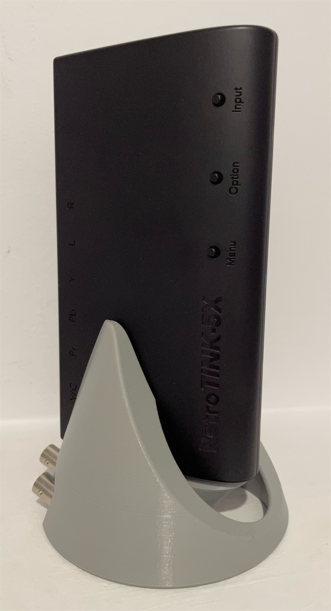

# RetroTINK 5X SCART Dock

Mike Chi's [RetroTINK 5X Pro](https://www.retrotink.com/product-page/5x-pro) is a blessing to the entire retro-gaming community. However the SCART port on the 5X has its issue, not to mention that nobody has any love left for the SCART standard itself. Personally, I'm also a fan of vertical stands for my devices. So here's my approach to tackle the matters.

This dock system puts the RetroTINK 5X into a vertical standing position. It taps into the SCART port, so RGBS + audio signals could be fed into the 5X, while providing extra stability.

------------

There are two version of the dock. One that uses the standard BNC and 3.5mm audio headers, and the other that makes use of my [VGA RGBS + audio pinout standard](https://github.com/jeffqchen/Console-VGA-Dongle-Series).

## [VGA Dock](https://github.com/jeffqchen/RetroTINK-5X-SCART-Dock/blob/main/VGA_Dock/README.md)

## [BNC Dock](https://github.com/jeffqchen/RetroTINK-5X-SCART-Dock/blob/main/BNC_Dock/README.md)

------------

## Special Thanks

Mike Chi, creator of the RetroTINK 5X. Helped me in various aspects of this project
- Website: https://www.retrotink.com
- Twitter: https://twitter.com/retrotink2
